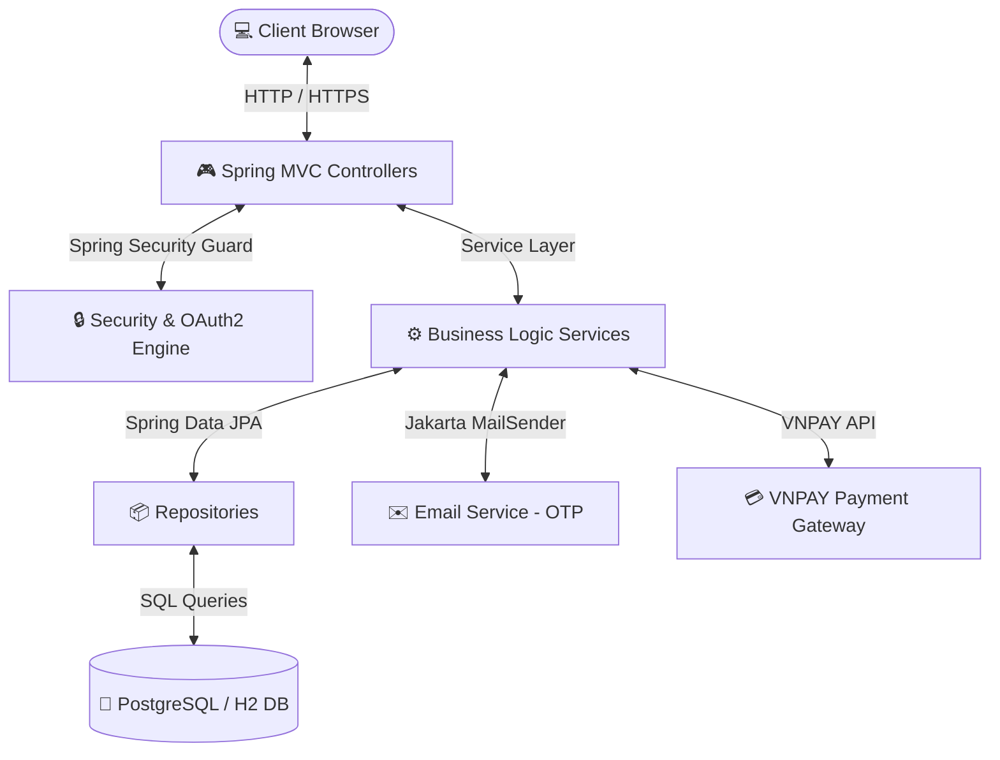

# 🌸 BloomResin - Nền Tảng Thương Mại Điện Tử & Đặt Hàng Thiết Kế Riêng Trang Sức Resin
> **Handcrafted Resin Jewelry E-Commerce & Custom Order Platform**

[](file:///c:/Users/admin/Desktop/hoahoehoahoet)
[](file:///c:/Users/admin/Desktop/hoahoehoahoet)
[](file:///c:/Users/admin/Desktop/hoahoehoahoet)
[](file:///c:/Users/admin/Desktop/hoahoehoahoet)
[](file:///c:/Users/admin/Desktop/hoahoehoahoet)

---

## 📌 1. Giới thiệu Tổng quan (Project Overview)

**BloomResin** là nền tảng thương mại điện tử chuyên biệt dành cho các sản phẩm trang sức và phụ kiện thủ công từ hoa thật ép nhựa Resin cao cấp (dây chuyền, bông tai, nhẫn, vòng tay, móc khóa, khay decor). Nền tảng không chỉ cung cấp giải pháp bán lẻ sản phẩm có sẵn mà còn tích hợp quy trình **Đặt hàng Thiết kế Riêng (Custom Orders)** cho phép khách hàng cá nhân hóa mẫu hoa và phụ kiện theo mong muốn.

Dự án được xây dựng theo kiến trúc **Spring Boot MVC chuẩn doanh nghiệp**, đáp ứng các tiêu chuẩn nghiêm ngặt về bảo mật (Spring Security, Google OAuth2, Bcrypt), tối ưu truy vấn dữ liệu (Spring Data JPA, PostgreSQL) và giao diện thân thiện, responsive trên mọi thiết bị.

---

## 🔥 2. Các Tính năng Nổi bật (Key Features)

### 🛒 1. Dành cho Khách hàng (Client Portal)
- **Xem & Tìm kiếm Sản phẩm**: Tìm kiếm nâng cao, lọc theo giá, phân loại theo danh mục sản phẩm (Dây chuyền giọt nước, Bông tai hoa baby, Nhẫn resin dát vàng, Vòng tay, Móc khóa, Khay decor...).
- **Đặt hàng Thiết kế Riêng (Custom Order Engine)**: Cho phép khách hàng chọn loại hoa khô, màu sắc nhựa resin, kích thước và kiểu khung mạ vàng/bạc để đặt mẫu thiết kế riêng theo yêu cầu.
- **Thanh toán & Đơn hàng**: Tích hợp thanh toán linh hoạt (VNPAY, Chuyển khoản ngân hàng, COD), xem lịch sử và theo dõi chi tiết trạng thái đơn hàng thời gian thực.
- **Tài khoản & Xác thực an toàn**: Đăng ký / Đăng nhập qua tài khoản hoặc đăng nhập nhanh qua **Google OAuth2**, tính năng quên mật khẩu qua mã xác minh OTP Email.
- **Tương tác Khách hàng**: Quản lý danh sách sản phẩm yêu thích (Wishlist), gửi đánh giá & bình luận sản phẩm kèm chấm điểm sao (Product Reviews & Ratings), gửi liên hệ hỗ trợ.

### 🛡️ 2. Dành cho Quản trị viên & Nhân viên (Admin & Employee Dashboard)
- **Thống kê Doanh thu & Báo cáo (Revenue Analytics)**: Biểu đồ thống kê doanh thu trực quan theo thời gian, báo cáo sản phẩm bán chạy và danh sách đơn hàng cần xử lý.
- **Quản lý Đơn hàng & Custom Orders**: Xử lý phê duyệt đơn bán lẻ và theo dõi/cập nhật tiến độ gia công cho các đơn hàng thiết kế riêng của khách hàng.
- **Quản lý Sản phẩm & Danh mục (Catalog Management)**: Quản trị danh mục, thêm mới/chỉnh sửa thông tin sản phẩm, cập nhật số lượng tồn kho, giá bán và hình ảnh.
- **Quản lý Người dùng & Phân quyền (RBAC)**: Quản lý danh sách tài khoản, hỗ trợ phân quyền đa dạng (`ROLE_ADMIN`, `ROLE_EMPLOYEE`, `ROLE_CUSTOMER`).
- **Quản lý Bài viết & Phản hồi**: Đăng tải tin tức/bài viết chia sẻ kinh nghiệm bảo quản đồ resin, tiếp nhận và phản hồi thông tin từ khách hàng.

---

## 🛠️ 3. Công nghệ Sử dụng (Tech Stack)

| Phân hệ | Công nghệ chính | Mô tả |
| :--- | :--- | :--- |
| **Backend Core** | Java 21, Spring Boot 3.2.10 | Framework mạnh mẽ, tối ưu hiệu năng và khả năng mở rộng |
| **Security & Auth** | Spring Security 6, Google OAuth2, Bcrypt | Bảo mật hệ thống, chống đe dọa an ninh mạng, xác thực SSO |
| **Data Layer** | Spring Data JPA (Hibernate), PostgreSQL, H2 | ORM quản lý dữ liệu, truy vấn tối ưu, hỗ trợ H2 cho Dev |
| **Communication** | Spring Mail (Jakarta Mail), OTP Email | Gửi mail tự động, xác minh tài khoản & quên mật khẩu |
| **Frontend / View** | JSP, JSTL, HTML5, CSS3, JavaScript, Bootstrap 5 | Giao diện chuẩn Spring MVC, responsive và thẩm mỹ cao |
| **DevOps & Tools** | Maven, Docker, Git | Quản lý phụ thuộc, đóng gói container và quản lý phiên bản |

---

## 📐 4. Kiến trúc Hệ thống (System Architecture)



---

## 📁 5. Cấu trúc Thư mục Dự án (Project Structure)

```text
hoahoehoahoet/
├── src/main/java/group03/bloomresin/
│   ├── config/             # Cấu hình Spring Security, OAuth2, Web MVC
│   ├── controller/         # Chứa Controllers (admin, client, employee)
│   ├── domain/             # Các JPA Entity (Product, Order, User, CustomOrder, Category...)
│   ├── repository/         # Spring Data JPA Repositories
│   ├── service/            # Xử lý Logic Nghiệp vụ (Business Services)
│   └── util/               # Các lớp Tiện ích (EmailSender, SecurityUtils...)
├── src/main/resources/
│   ├── application.properties
│   └── data.sql            # Mẫu Dữ liệu Khởi tạo (Seed Data)
├── src/main/webapp/WEB-INF/jsp/ # Các trang Giao diện JSP (Admin & Client Templates)
├── Dockerfile              # Cấu hình Đóng gói Docker Container
├── pom.xml                 # Khai báo Phụ thuộc Maven Dependencies
└── README.md               # Tài liệu Giới thiệu Dự án
```

---

## 🚀 6. Hướng Dẫn Khởi Chạy Cục Bộ (Local Setup)

### Yêu cầu tiên quyết
- **JDK 21** trở lên
- **Apache Maven 3.8+**
- **PostgreSQL** (hoặc mặc định chạy trên H2 In-Memory Database)

### Các bước thực hiện:

1. **Clone repository**:
   ```bash
   git clone http://git.fa.edu.vn/ct25_cpl_java_01/intern_fu_ct_2025_s1_g4/bloomresingr4.git
   cd bloomresin
   ```

2. **Biên dịch và đóng gói với Maven**:
   ```bash
   ./mvnw clean package -DskipTests
   ```

3. **Khởi chạy ứng dụng**:
   ```bash
   ./mvnw spring-boot:run
   ```
   *Ứng dụng sẽ khả dụng tại địa chỉ*: `http://localhost:8080`

---

## 👤 7. Tác Giả & Liên Hệ (Author & Contact)

- **Họ và tên**: Cao Huỳnh Ngọc Như
- **Vị trí mong muốn**: Full-stack Developer / Java Back-end Developer (Java Spring Boot / React / Node.js)
- **GitHub**: [github.com/NgocNhu1824](https://github.com/NgocNhu1824)
- **Project Repository**: [hoahoehoahoet](https://github.com/NgocNhu1824/hoahoehoahoet)

---
*Cảm ơn Quý doanh nghiệp / Nhà tuyển dụng đã dành thời gian xem qua dự án!* 🚀
